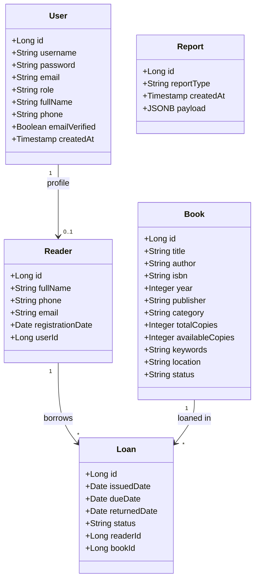

```mermaid
classDiagram

    class User {
        +Long id
        +String username
        +String password
        +String email
        +String role
        +String fullName
        +String phone
        +Boolean emailVerified
        +Timestamp createdAt
    }

    class Reader {
        +Long id
        +String fullName
        +String phone
        +String email
        +Date registrationDate
        +Long userId
    }

    class Book {
        +Long id
        +String title
        +String author
        +String isbn
        +Integer year
        +String publisher
        +String category
        +Integer totalCopies
        +Integer availableCopies
        +String keywords
        +String location
        +String status
    }

    class Loan {
        +Long id
        +Date issuedDate
        +Date dueDate
        +Date returnedDate
        +String status
        +Long readerId
        +Long bookId
    }

    class Report {
        +Long id
        +String reportType
        +Timestamp createdAt
        +JSONB payload
    }

    User "1" --> "0..1" Reader : profile
    Reader "1" --> "*" Loan : borrows
    Book "1" --> "*" Loan : loaned in
```
