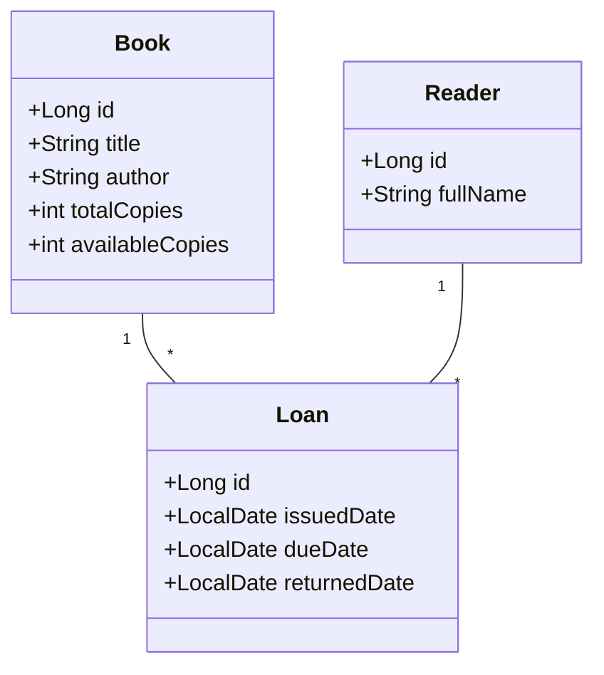

```mermaid
classDiagram
    class Book{
      +Long id
      +String title
      +String author
      +int totalCopies
      +int availableCopies
    }
    class Reader{
      +Long id
      +String fullName
    }
    class Loan{
      +Long id
      +LocalDate issuedDate
      +LocalDate dueDate
      +LocalDate returnedDate
    }
    Book "1" -- "*" Loan
    Reader "1" -- "*" Loan
```
