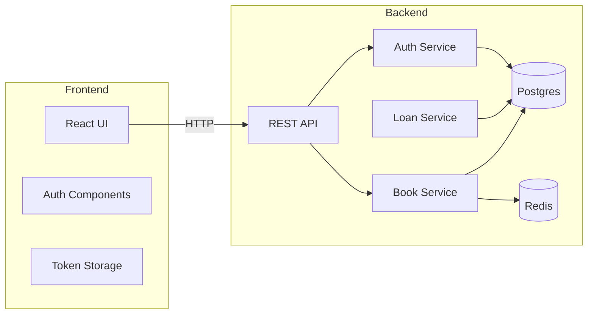

```mermaid
graph LR
  subgraph Frontend
    UI[React UI]
    Auth[Auth Components]
    Store[Token Storage]
  end
  subgraph Backend
    API[REST API]
    AuthSvc[Auth Service]
    LoanSvc[Loan Service]
    BookSvc[Book Service]
    DB[(Postgres)]
    Cache[(Redis)]
  end
  UI -->|HTTP| API
  API --> AuthSvc
  API --> BookSvc
  BookSvc --> DB
  BookSvc --> Cache
  LoanSvc --> DB
  AuthSvc --> DB
```
