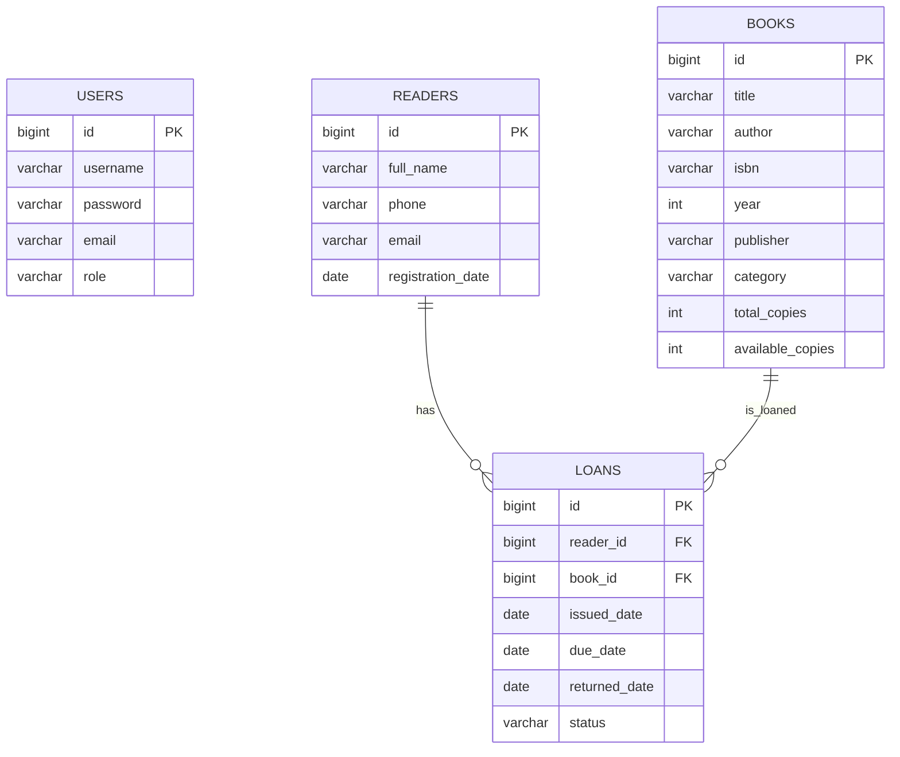

```mermaid
erDiagram
    USERS {
        bigint id PK
        varchar username
        varchar password
        varchar email
        varchar role
    }
    READERS {
        bigint id PK
        varchar full_name
        varchar phone
        varchar email
        date registration_date
    }
    BOOKS {
        bigint id PK
        varchar title
        varchar author
        varchar isbn
        int year
        varchar publisher
        varchar category
        int total_copies
        int available_copies
    }
    LOANS {
        bigint id PK
        bigint reader_id FK
        bigint book_id FK
        date issued_date
        date due_date
        date returned_date
        varchar status
    }

    READERS ||--o{ LOANS : "has"
    BOOKS ||--o{ LOANS : "is_loaned"
```
